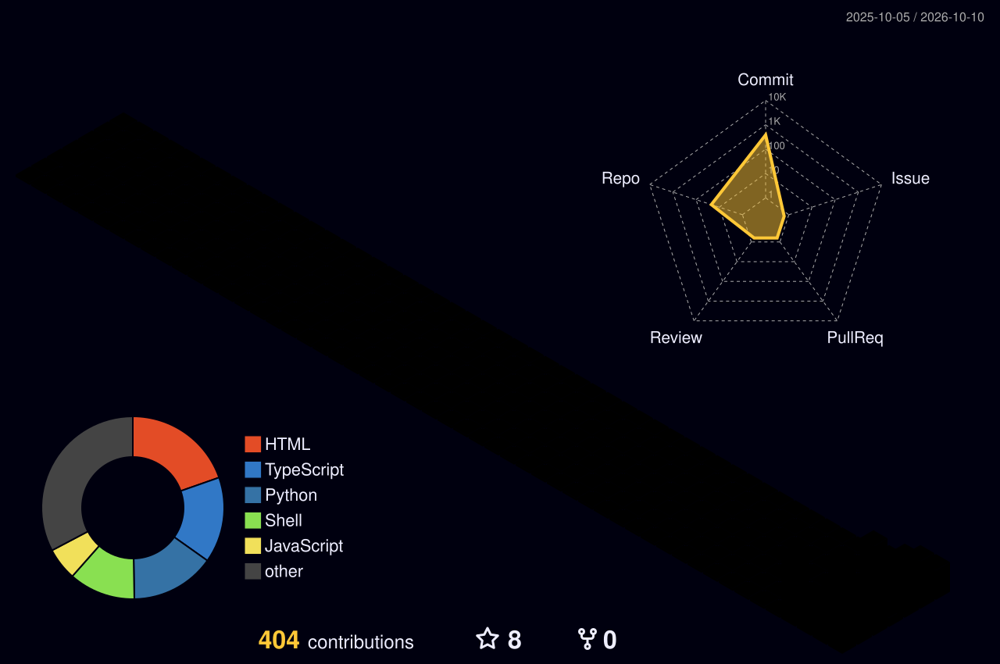

<div align="center">


**[navairgap.github.io](https://navairgap.github.io) — portfolio →**
**[3d-portfolio](https://3d-portfolio-nav-8975.vercel.app) — step inside the room →**
**[navairgap OS](https://navairgap.github.io/os/) — a portfolio you can boot →**

<picture>
  <source media="(prefers-color-scheme: dark)" srcset="./profile-3d-contrib/profile-night-rainbow.svg" />
  <source media="(prefers-color-scheme: light)" srcset="./profile-3d-contrib/profile-green-animate.svg" />
  
</picture>


</div>

```text
・ 源 SOURCE ・ 力 POWER ・ 美 BEAUTY ・ 道 WAY ・ 信 SIGNAL ・ 防 DEFENSE ・
```

- 🛡 **defense first** — I build passive, local-first security tools; CI greps my flagship repo on every push to prove it stays offense-free
- 🖥 **backend developer** — real-time systems, APIs, and the glue between them
- 🧠 **learning in public** — networking → python → security → C → operating systems, documented as I go
- 🐧 daily driver: **linux**. bone on black, no shadows, grain 5.5%

<div align="center">

</div>

## 📟 ・ 源 — the skull

<p align="center">
  
</p>

<p align="center"><i>&gt;&gt; anonymity is a design choice ・ 信</i></p>

<div align="center">

</div>

## 🚀 ・ 美 — projects

<p align="center">
  
  &nbsp;
  
</p>

**[SentinelWiFi](https://github.com/navairgap/SentinelWiFi)** — passive network security auditor. Evil-twin & rogue-DHCP detection, device inventory with newcomer alarms, exposed-service scanning, WPS/PMF analysis — graded A–F with plain-language fixes. 36 tests. CI-enforced. 100% passive.

**[banter](https://github.com/navairgap/banter)** — real-time public chat rooms. No accounts, no database. XSS-proof by construction, two-client integration tests.

**[python-projects](https://github.com/navairgap/python-projects)** — six complete CLI tools in pure stdlib Python: passwords, todos, weather, disk audit, network diagnostics, a static server. 30+ tests, CI green across 3.9–3.12, zero dependencies.

**[dotfiles](https://github.com/navairgap/dotfiles)** — Nothing OS × Hyprland rice. floating pill taskbar, dot-matrix widgets, JND fonts, generated wallpapers.

**airgap-os** *(repo coming soon)* — a hobby kernel in progress: multiboot handoff, VGA driver, interrupts, memory, syscalls — the deepest way to learn how computers work.

<div align="center">

</div>

## 🛠 ・ 力 — arsenal

<p align="center">
  
</p>

<p align="center">
  
  
</p>

<p align="center">
  
</p>

## 🐍 contribution graph

<picture>
  <source media="(prefers-color-scheme: dark)" srcset="dist/github-snake-dark.svg">
  <source media="(prefers-color-scheme: light)" srcset="dist/github-snake.svg">
  
</picture>

<div align="center">

</div>

<p align="center">
  <a href="https://navairgap.github.io"></a>
  &nbsp;
  
</p>

---

<div align="center">
  <i>"the best security tool is the one that's honest about what it doesn't do."</i>
</div>
