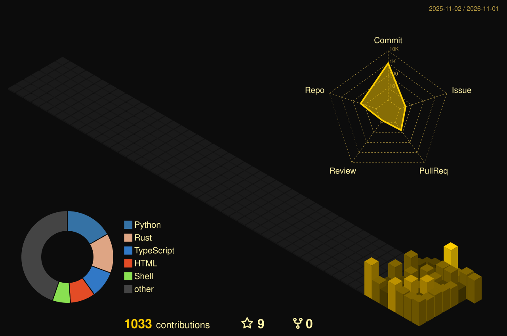

  <a href="https://navairgap.github.io">Portfolio</a>
  &nbsp;·&nbsp;
  <a href="https://3d-portfolio-nav-8975.vercel.app">3D Portfolio</a>
  &nbsp;·&nbsp;
  <a href="https://navairgap.github.io/os/">Portfolio OS</a>

  <strong>LANGUAGES & SCRIPTING</strong> 
  
  
  
  
  
  
  
  
  
  

  <strong>SYSTEMS & NETWORKING</strong> 
  
  
  
  
  
  
  
  

  <strong>CYBERSECURITY & SECURITY TOOLS</strong> 
  
  
  
  
  
  
  
  
  
  
  
  

<picture>
  <source media="(prefers-color-scheme: dark)" srcset="https://raw.githubusercontent.com/navairgap/navairgap/main/dist/github-snake-yellow-dark.svg" />
  <source media="(prefers-color-scheme: light)" srcset="https://raw.githubusercontent.com/navairgap/navairgap/main/dist/github-snake-yellow.svg" />
  
</picture>

